# Social Network

## Description
I have been expanding my knowledge on web development. My research has led me to mongo_DB. I have stepped away from mysql to mongo_DB a different type of database. I want to make another project to show others some of the skills I learned from mongo_DB. A great way of showing my skills is with a social network project. Users will be able to make calls to my server to either save, delete, and update certain features in my project. All the calls to the server will return data from mongo_DB. Also mongo_DB is not a relational database, so we have to take that into account when making the project. We have to manage the connections between different tables in our project. I got a chance to make a subdocument in my project. By the end of this project we should be able to make query calls, use virtuals to add on to our project schema, and getters to format data at query call time. 

## Table of Contents

[Installation](#installation)

[Usage](#usage)

[Credits](#credits)

[License](#license)

[Badges](#badges)

[Tests](#tests)

[Questions](#questions)

## Installation

To install our project we need node js. Along with libraries to give us access to mongo_DB, and express to make our application listen to query calls. Now to install node you can go to the website to see the installation steps to get node on your device.
 
Then the next step to getting our project set to use users will have to install the libraries in the package json file.
 
    npm i
 
The command above will install the libraries. If the previous command did not work try the following commands to install the nesccary libraries.
 
    npm i express
    npm i mongoose
 

## Usage

The project has many different calls to provide users with data or manipulate of data. I will first explain how to make calls to the social network project. Then I will show images with examples of the different calls made. In our project we will have two different api routes for the project and no home page. With this project we will not have a gui to make all the api calls to our server. The different paths will be listed below.

* User api calls:

http://localhost:3001/api/users
 
http://localhost:3001/api/user/:userID
 
http://localhost:3001/api/users/:userID/friends
 
http://localhost:3001/api/users/:userID/friends/:friendsID

* Thought api calls 

http://localhost:3001/api/thoughts
 
http://localhost:3001/api/thoughts/:thoughtsID
 
http://localhost:3001/api/thoughts/:thoughtsID/reaction
 
http://localhost:3001/api/thoughts/:thoughtsID/reaction/:reactionID
 
The calls to our server include the following operations get, post, delete, and put. The last two calls to the server from users and thoughts will preform a get and post to a specific embeded item in the schemas. For users they have a reference to another user and it is stored as a friend variable. The two calls to friend will let us add a new friend and remove a friend. Thoughts is similar to user, but instead of having a reference to another thought we have a subdocument in our thought. The calls to the server will add a reaction to a thought or remove a reaction. Another thing to mention before showing images is that we have virtuals in users and thoughts to add an extra piece of information at the time of the query call. Along with the virtuals there are getters doing the same task as the virtuals but we are manipulating a data enrty before completing the query. The original data is not changed by the getter.

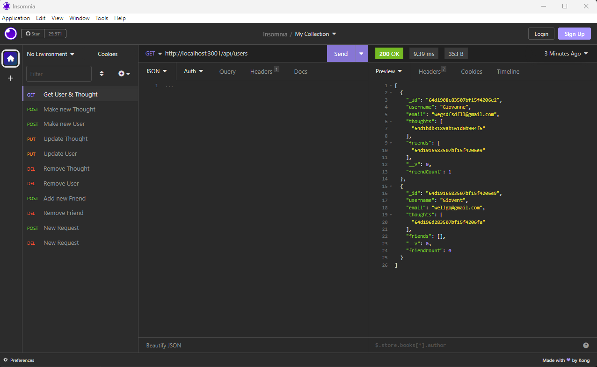

Get User

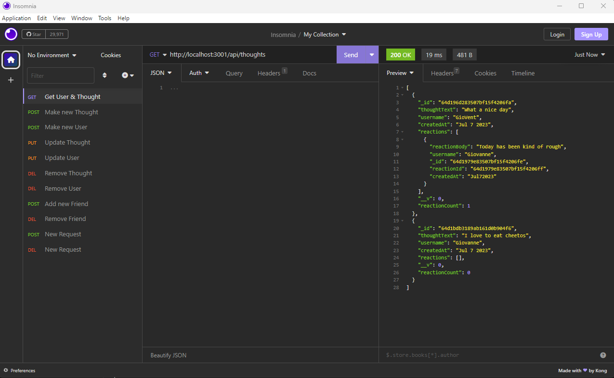

Get Thought

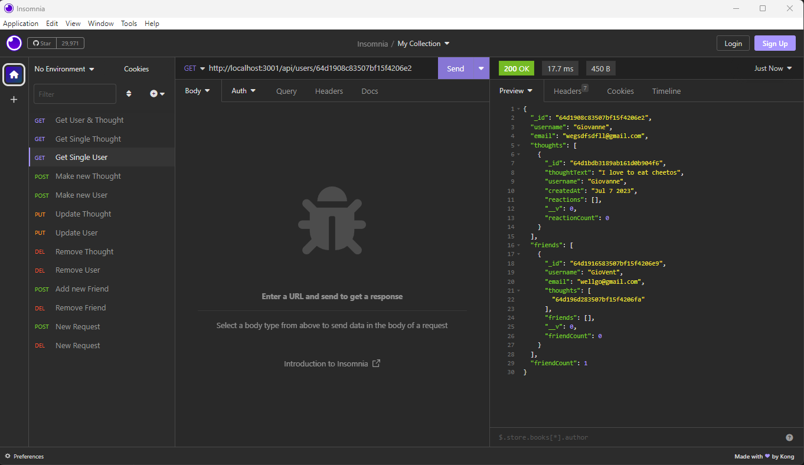

Get Single User

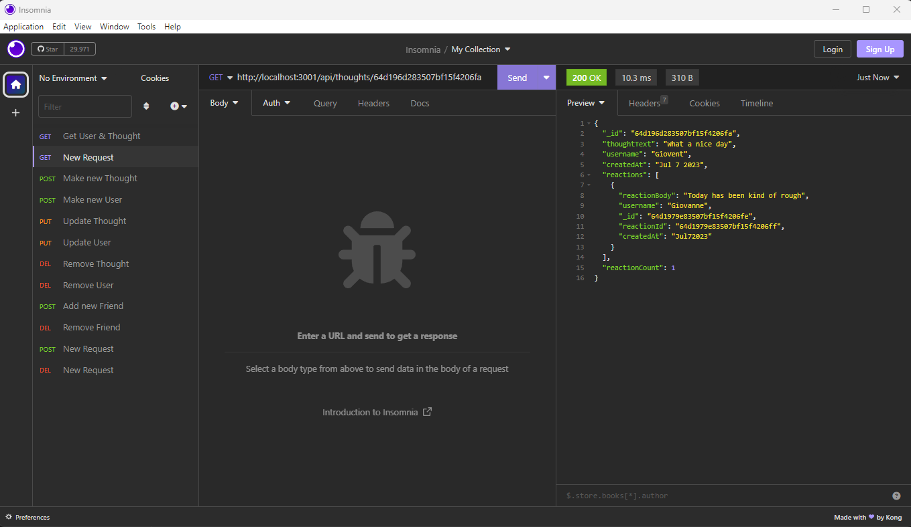

Get Single Thought

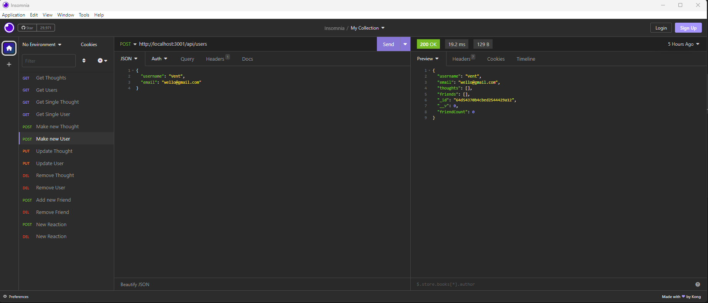

Post User

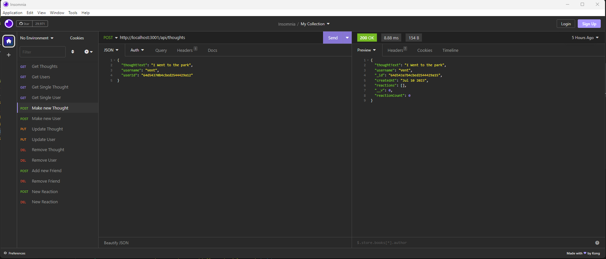

Post Thought

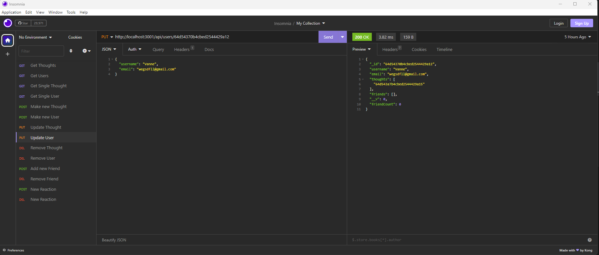

Put User

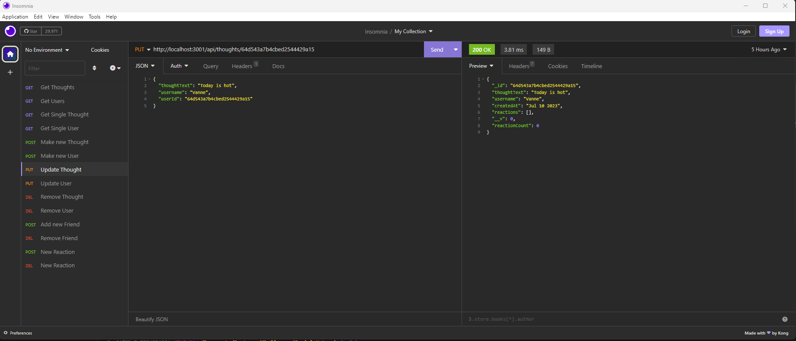

Put Thought

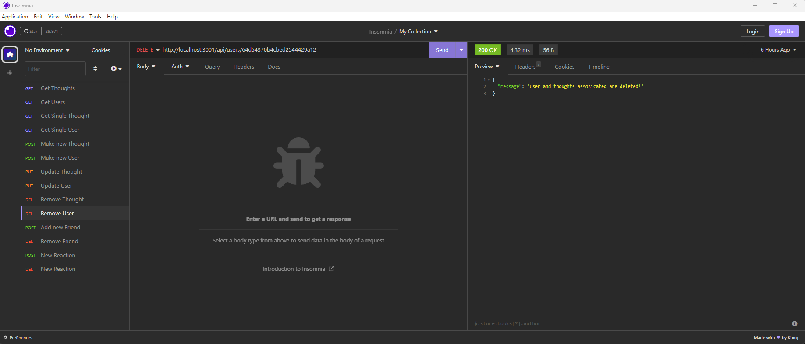

Delete User

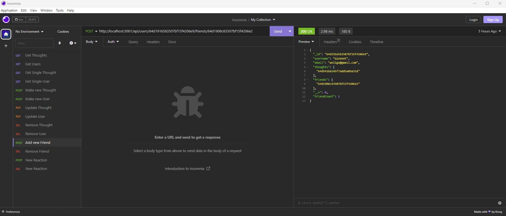

Post Friend

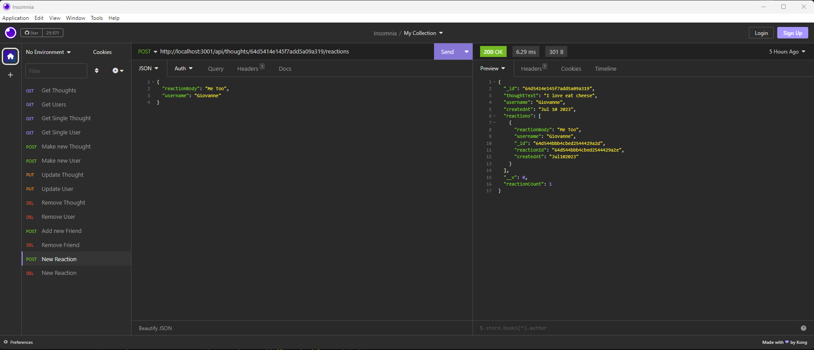

Post Reaction

Last thing to say is that I added only one delete query call, but the rest for the different paths is similar you just have to add the right id in the call and the entry will be deleted. Also something you may have seen is the extra data from a different table or subdocument. The extra data is added through the special keyword populate. Find returns all data from the table based on the parameters passed in. FindOne returns the first item in the table that meets the requirments passed in. FindOneandUpdate is similar to findOne, but we are changing some or all the data in the found result. FindOneandRemove removes the first entry that meets the parameters passes and deletes it from the table specified. Next one would be create which makes a new entry to put in a new in the table specified. Now to learn more about the different query calls to the server then look up the mongoose documentation for more information.

Demo Video: https://drive.google.com/file/d/1rfkKeR1095Lxh_2iXz2Hi4YaTO9T0RRZ/view

## Credits
Thank you mongoose for providing information on getters and giving general information on query. Also thank you to mdn web docs for providing information on the Date library in javascript  

## License

The project is covered by the MIT license. Please refer to the repo for more information on the license. The link below we will link users to the template followed to make license.

License Link: https://spdx.org/licenses/MIT.html

## Badges

## Tests

N/A

## Questions

Any questions you may have you can contact me through my email shown below and there is a link to my github account.

Email: gvv8106@gmail.com

GitHub Profile: https://github.com/giovanne-villanueva